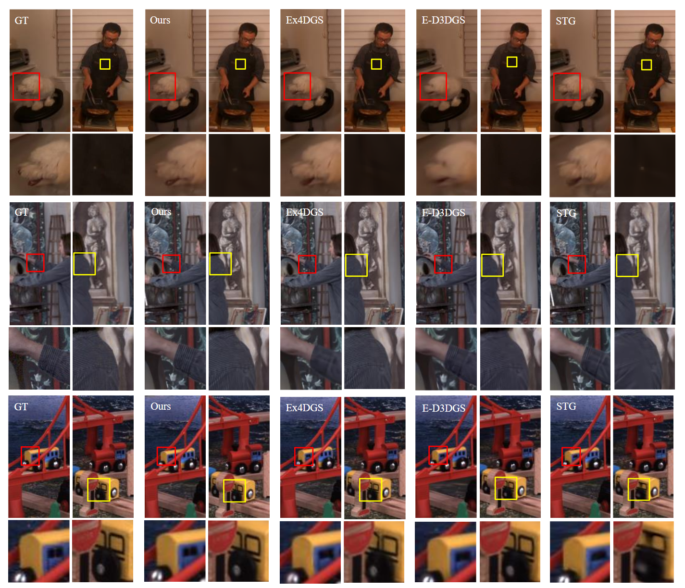

# CEM4DGS: Clustered Error Correction with Grouped 4D Gaussian Splatting

<div align="center">

### [Project Page](https://tho-kn.github.io/projects/CEM-4DGS) | [Short Video](https://github.com/tho-kn/CEM4DGS/blob/main/media/video.mov)

**SIGGRAPH Asia 2025**

[Taeho Kang](https://github.com/tho-kn)<sup>1</sup>, [Jaeyeon Park](https://github.com/jaeyeon-park)<sup>1</sup>, [Kyungjin Lee](https://github.com/kyungjin-lee)<sup>1</sup>, [Youngki Lee](https://github.com/youngki-lee)<sup>1</sup>

<sup>1</sup>Seoul National University

</div>

<object data="./media/video.mov" type="video/mp4" width="100%" height="600px"></object>



## Abstract
Existing 4D Gaussian Splatting (4DGS) methods struggle to accurately reconstruct dynamic scenes, often failing to resolve ambiguous pixel correspondences and inadequate densification in dynamic regions. We address these issues by introducing a novel method composed of two key components: (1) Elliptical Error Clustering and Error Correcting Splat Addition that pinpoints dynamic areas to improve and initialize fitting splats, and (2) Grouped 4D Gaussian Splatting that improves consistency of mapping between splats and represented dynamic objects. Specifically, we classify rendering errors into missing-color and occlusion types, then apply targeted corrections via backprojection or foreground splitting guided by cross-view color consistency. Evaluations on Neural 3D Video and Technicolor datasets demonstrate that our approach significantly improves temporal consistency and achieves state-of-the-art perceptual rendering quality, improving 0.39dB of PSNR on the Technicolor Light Field dataset. Our visualization shows improved alignment between splats and dynamic objects, and the error correction method's capability to identify errors and properly initialize new splats. Our implementation details and source code are available at https://github.com/tho-kn/cem-4dgs.

## Method Overview
CEM4DGS extends 4D Gaussian Splatting with the following key contributions:

- **Clustered Error Correction**: A novel error correction mechanism that groups erroneous pixels into elliptical clusters and applies targeted corrections via backprojection or foreground splitting guided by cross-view color consistency.
- **Grouped 4D Gaussians**: Group-based dynamic representation that gradually splits group based on individual splat's deviation from their group's motion to enable efficient motion modeling.

## Installation
### Prerequisites
- Python 3.9+
- CUDA-compatible GPU (tested on RTX A6000)
- PyTorch 1.12+ with CUDA support (tested with CUDA 11.8)

### Environment Setup
1. Clone the repository:
```bash
git clone https://github.com/tho-kn/CEM4DGS.git
cd CEM4DGS
```

2. Create and activate conda environment:
```bash
conda create -n CEM4DGS python=3.9
conda activate CEM4DGS
```

3. Install PyTorch (adjust CUDA version as needed):
```bash
pip install torch torchvision torchaudio --index-url https://download.pytorch.org/whl/cu118
```

4. Install remaining dependencies:
```bash
pip install --upgrade setuptools cython wheel
pip install -r requirements.txt
```

## Dataset Preparation
We support two main datasets following the preprocessing pipeline from [STG](https://github.com/oppo-us-research/SpacetimeGaussians):

### Neural 3D Video Dataset
1. Download the dataset from the [official repository](https://github.com/facebookresearch/Neural_3D_Video)

2. Set up preprocessing environment:
```bash
./scripts/env_setup.sh
```

3. Preprocess all sequences:
```bash
./scripts/preprocess_all_n3v.sh <path_to_dataset>
```

### Technicolor Dataset
1. Download from the [official source](https://www.interdigital.com/data_sets/light-field-dataset). You need to request for a permission to access the dataset.

2. Preprocess sequences:
```bash
./scripts/preprocess_all_techni.sh <path_to_dataset>
```

## Training
### Script for Training a Single Scene
Train on a single scene, train step 1 first, then train step 2 from the checkpoint of step 1.
```bash
python train.py --config configs/<dataset>_s1/<scene_config>.json \
                --model_path <output_directory> \
                --source_path <path_to_preprocessed_scene>
```

```bash
python train.py --config configs/<dataset>_s2/<scene_config>.json \
                --model_path <output_directory> \
                --source_path <path_to_preprocessed_scene> \
                --start_checkpoint <path_to_step1_checkpoint>
```


### Configuration Files
We provide pre-configured training settings for different datasets:
- `configs/N3V_s1/`: Neural 3D Video dataset (Step 1)
- `configs/N3V_s2/`: Neural 3D Video dataset (Step 2) 
- `configs/techni_s1/`: Technicolor dataset (Step 1)
- `configs/techni_s2/`: Technicolor dataset (Step 2)

## Evaluation
### Rendering and Metrics
Evaluate trained models:
```bash
python render.py --model_path <path_to_trained_model> \
                 --source_path <path_to_dataset> \
                 --skip_train \
                 --iteration <checkpoint_iteration>
```

## Pre-trained Models
Pre-trained models for various scenes are available in our [Releases](https://github.com/tho-kn/CEM4DGS/releases/tag/v1.0.0).

Download and extract to use with the evaluation scripts above.

## Acknowledgments
This work builds upon several great open source projects:
- [3D Gaussian Splatting](https://github.com/graphdeco-inria/gaussian-splatting) for the foundational splatting framework
- [Ex4DGS](https://github.com/juno181/Ex4DGS) for the base codebase architecture
- [STG](https://github.com/oppo-us-research/SpacetimeGaussians) for dataset preprocessing pipelines

We thank the authors of these works for making their code publicly available.

## Citation
If you find this work useful for your research, please cite:

```bibtex
@inproceedings{kang2025cem4dgs,
  title={Clustered Error Correction with Grouped 4D Gaussian Splatting},
  author={Kang, Taeho and Park, Jaeyeon and Lee, Kyungjin and Lee, Youngki},
  booktitle={SIGGRAPH '25: ACM SIGGRAPH 2025 Conference Papers},
  year={2025}
}
```